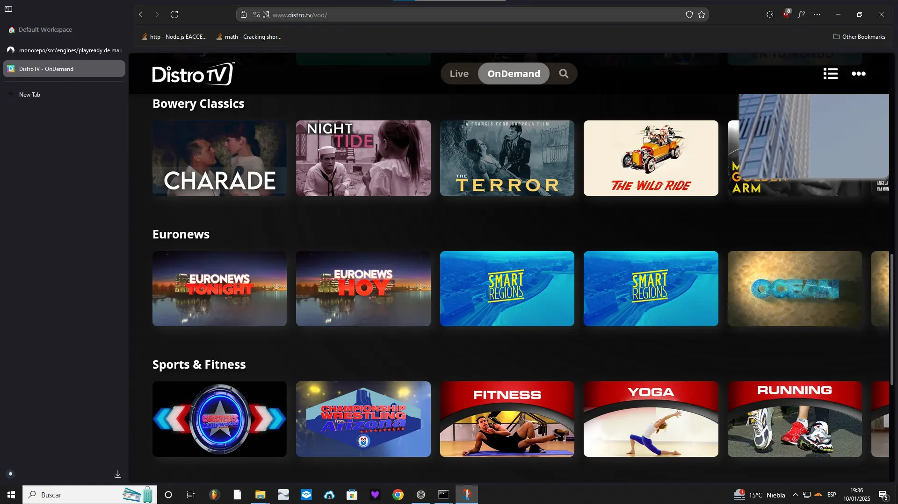

### (i) Scarce documentation. REVISIONS NEEDED.

DistroTV is an ad-supported streaming service launched by DistroScale in 2021.




The platform doesn't have any kind off UUID for a show unlike most services. A show's URL will look something like this: `https://www.distro.tv/show/pablo`, so we can extract the show name by just extracting the path after /show. From now on we'll use the show Pablo as an example.

When playing a title, a request to `https://tv.jsrdn.com/tv_v5/show.php?name=pablo` is made. 

The response is attached on `distrotv_response.json`. It includes IP geolocation, adtags, metadata about the title and the playlist URL.

We can get the name for the savename on the `:shows` parent element on the JSON response. This element has a child with the ID of the show[0].
The block is something like this (cleaned up and removed useless things):
```
"shows": {
    "2853": {
      "id": 2853,
      "content_provider": 23019,
      "title": "Pablo",
      "name": "pablo",
      "keywords": "Pablo,espanol",
      "genre": "Entertainment",
      "categories": "IAB1",
   }
}
```

(i). Note that this is an incomplete request. Check `distrotv_response.json`. 


We can extract the show name `Pablo` either from `title` or from `name`, but, due to capitalization, it's better to catch the `title` instead. 

Now, to get the playlist URL, a `*.cloudfront.net/*/*/*/*/master.m3u8*` is enough. The final M3U8 url is gonna be something like this:

`https:\/\/d14c63magvk61v.cloudfront.net\/hls\/23019\/vid\/152730\/master.m3u8?ads.islive=0&ads.streamtype=vod&ads.vf=20250110`
 

 It's unencrypted, so just feed it to N_m3u8DL-RE, aria2c or whatever downloader are you using and add the metadata with MKVToolnix.

 There's a service in `/src/modules/distrotv/service.rs`. Feel free to look up it or modify it.
